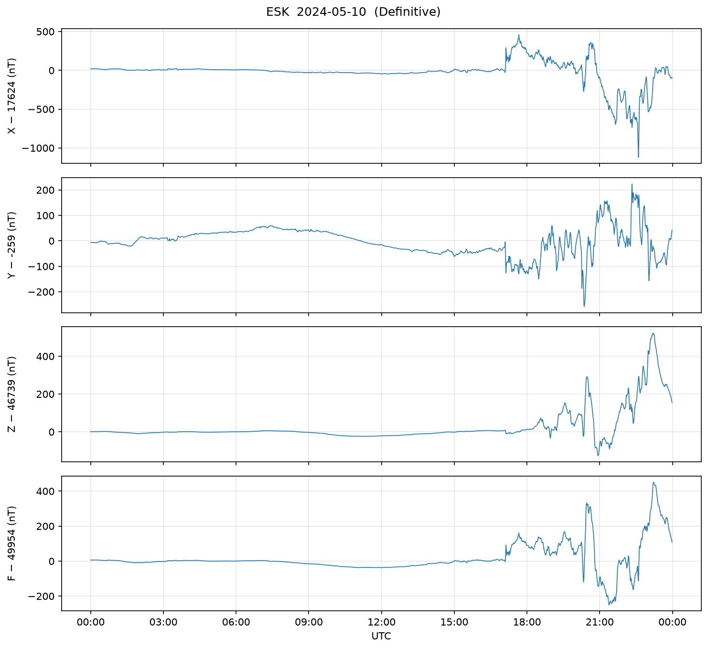
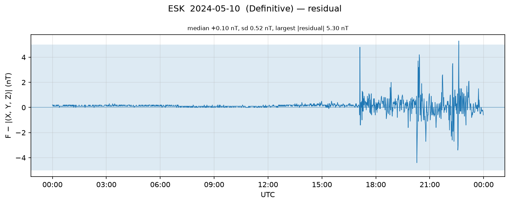
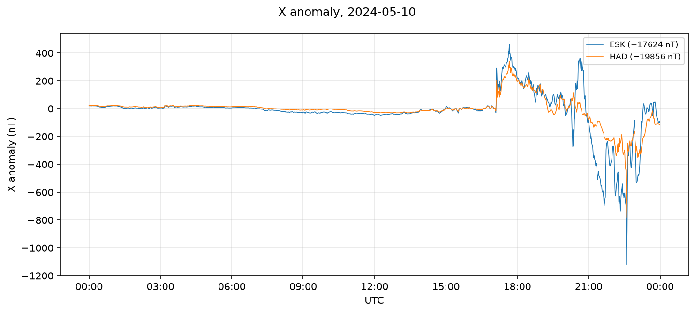

# magpipe

Ingest, validate, store and plot ground magnetometer observatory data
distributed in the IAGA-2002 exchange format.

## Example output

Eskdalemuir, 10 May 2024 — the Gannon storm. Definitive one-minute data,
baselines removed, gaps shaded.

Scalar minus vector total field over the same interval. F comes from an
independent scalar instrument, so the residual is a check on both
instruments rather than an identity.

Eskdalemuir and Hartland overlaid, showing the disturbance is regional
rather than local to one observatory.

## What it does

    fetch    retrieve observatory data from the INTERMAGNET GIN web service,
             with on-disk caching and retry
    parse    read IAGA-2002 into a typed, UTC-indexed DataFrame
    validate run quality checks: cadence, ordering, completeness, range,
             spikes, and agreement between the scalar and vector fields
    plot     per-element time series with gaps shaded, the scalar/vector
             residual, and multi-observatory comparisons

Storage in PostgreSQL is not yet implemented.

## Quick start

    python -m venv .venv
    .venv\Scripts\activate                 # Windows
    source .venv/bin/activate              # Linux, macOS
    pip install -e ".[dev]"
    pytest

Download a day of data from two UK observatories over the May 2024 storm,
then parse and validate it:

    python scripts/fetch_data.py --obs ESK HAD --start 2024-05-10 --check

Cut a small extract for the integration tests:

    python scripts/make_sample.py data/raw/esk_20240510_1d_minute_*.min \
        --hours 6 --label esk_storm

## Repository size

Whole days of one-minute data run to a few hundred kilobytes per
observatory and accumulate quickly, so `data/` is excluded from version
control entirely. Only the extracts under `tests/data/` are committed:
six hours at one-minute cadence is 360 records, around 30 kB, which is
enough for the integration tests to exercise real files without the
repository carrying an archive.

## Container

    docker compose run --rm test
    docker compose run --rm cli scripts/fetch_data.py --obs ESK \
        --start 2024-05-10 --orientation XYZS --check

The image is built in two stages so that build tooling does not reach
the runtime layer, and runs as an unprivileged user. `data/` and
`docs/figures/` are bind-mounted, so downloads and figures persist on
the host and INTERMAGNET data never enter the image.

## Continuous integration

`.github/workflows/ci.yml` runs on every push and pull request: ruff
lint and format checks, the test suite on Python 3.11, 3.12 and 3.13
with coverage, then a Docker build which runs the suite again inside
the image. Because no test performs network access, a CI run and a
local run exercise exactly the same code paths.

## Testing

Unit tests use synthetic IAGA-2002 fixtures generated by
`tests/fixtures/_make_fixtures.py`, which lets each test construct
exactly the defect it exists to detect. Integration tests under
`tests/test_real_data.py` run against real extracts and are skipped
automatically when `tests/data/` is empty. No test performs network
access; HTTP is exercised through a stub session.

    pytest                      # everything available
    pytest --cov=magpipe        # with coverage

## Data source and acknowledgement

Data are retrieved from the INTERMAGNET web service operated by the
British Geological Survey at
`https://imag-data.bgs.ac.uk/GIN_V1/GINServices`.

INTERMAGNET data are made available under the Creative Commons
Attribution-NonCommercial 4.0 licence (CC BY-NC 4.0) and are subject to
INTERMAGNET's conditions of use, which should be consulted before any
redistribution or publication.

> The results presented in this work rely on data collected at magnetic
> observatories. We thank the national institutes that support them and
> INTERMAGNET for promoting high standards of magnetic observatory
> practice (https://intermagnet.org).

## Layout

    magpipe/fetch.py             GIN web service client, caching, retry
    magpipe/plot.py              time series, residual and comparison figures
    magpipe/parse.py             IAGA-2002 parser
    magpipe/validate.py          quality checks
    scripts/fetch_data.py        download into data/raw/
    scripts/plot_day.py          write figures into docs/figures/
    scripts/make_sample.py       cut an attributed extract into tests/data/
    tests/fixtures/              synthetic files, committed
    tests/data/                  real extracts, committed, attributed
    data/                        download cache, not committed
    docs/                        design note and test report
